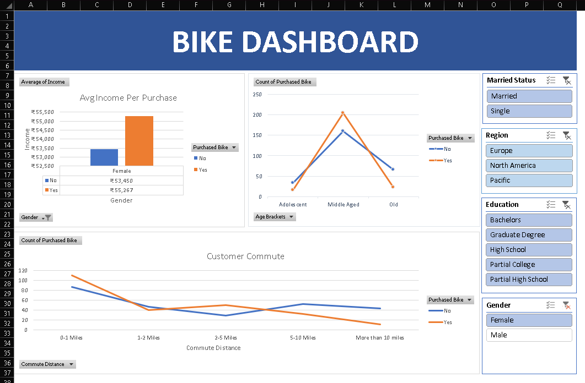

# 🚲 Bike Dashboard  

## 📌 Project Description  
An Excel dashboard to study bike purchase behavior using customer data. It shows how income, age, gender, education, and region affect bike buying.  

## 📊 Dataset  
File: <a href="https://github.com/O-ASwIN-O/Excel_Dashboard/blob/main/Excel%20Project%20Dataset.xlsx">DATASET</a>
  
## ❓ Questions Answered  
- Does **income** affect bike purchases?  
  👉 Yes, buyers (especially females) have higher average income.  

- Which **age group** buys the most bikes?  
  👉 Middle-aged customers purchase the most.  

- How does **commute distance** relate to purchases?  
  👉 Short commutes (0–1 mile) have higher purchases.  

- Do **filters** like Gender, Region, Education, and Marital Status change the buying pattern?  
  👉 Yes, slicers allow detailed analysis by these factors.  

## ⚙️ Process  
- Cleaned data (removed duplicates, trimmed spaces).  
- Created **Age Brackets**.  
- Used **Pivot Tables** for analysis.  
- Built interactive **Dashboard** with slicers & charts.  

## 📷 Dashboard  

